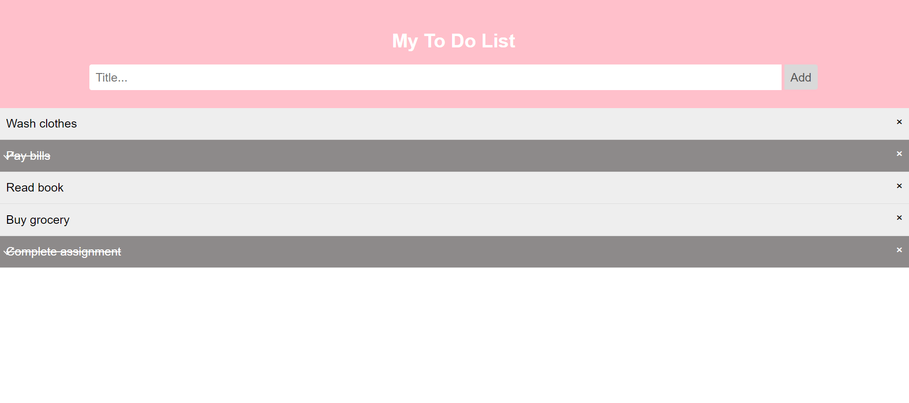
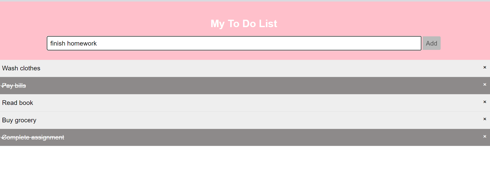
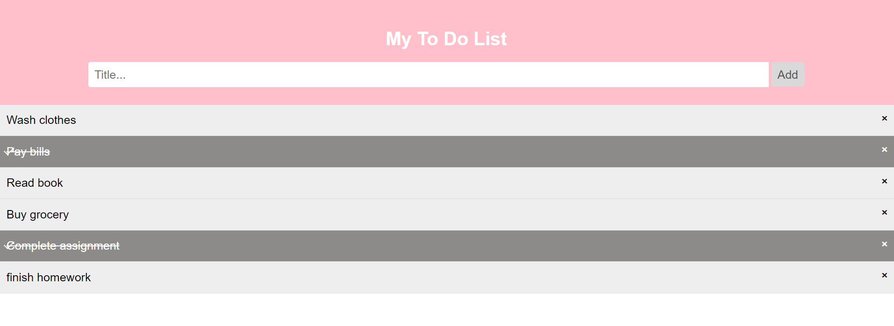
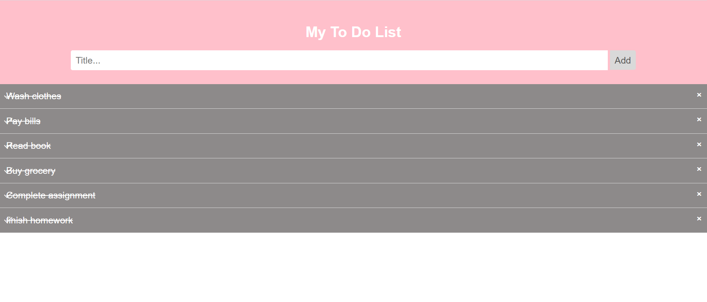

# To-Do List Application

A simple and interactive To-Do List application built with HTML, CSS, and JavaScript. This application allows users to add, check off, and remove tasks from their list.

## Features

- Add new tasks to the list
- Mark tasks as completed by clicking on them
- Remove tasks from the list using the close button
- Responsive design for better usability across different devices

## Technologies Used

- **HTML**: For structuring the content
- **CSS**: For styling and layout
- **JavaScript**: For interactivity and dynamic functionality

## Preview

Main Screen 

Adding a task finish homework

Finish homework is added to list of tasks

The task can be marked as done by clicking on the task

## Code Structure
HTML: Defines the structure of the To-Do List, including the input field, add button, and list items.
CSS: Styles the application, including the layout, colors, and hover effects.
JavaScript: Handles the functionality of adding new tasks, marking tasks as completed, and removing tasks from the list.

Key JavaScript Functions
createCloseButtons(): Adds close buttons to existing list items.
newElement(): Creates a new list item when the "Add" button is clicked.
Event listeners handle clicking on list items to mark them as completed and clicking on close buttons to remove items.

## Contact
For any questions or feedback, you can reach me at nehaannie2002@gmail.com

